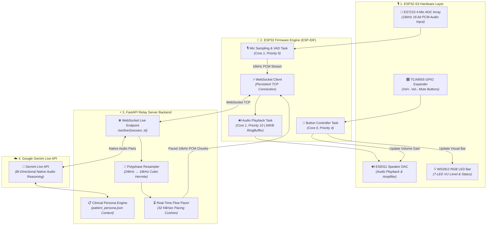
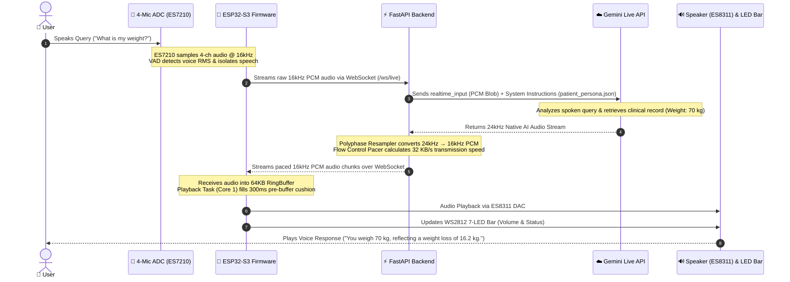
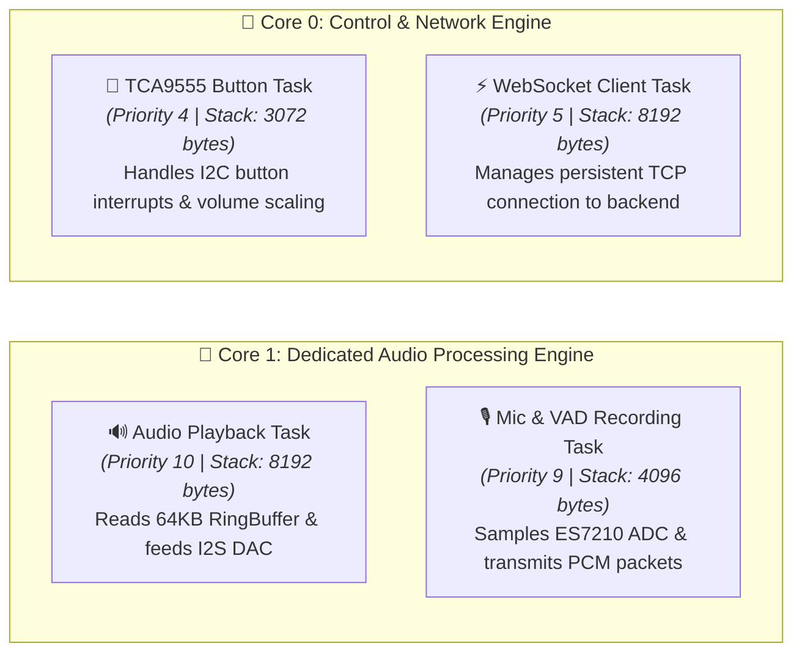
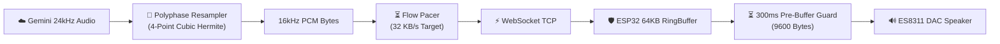

# 🎙️ ESP32-S3 Healthcare Voice Assistant with Google Gemini Live API
## Complete System Architecture & End-to-End Execution Flow Documentation

---

## 📑 Table of Contents
1. [Executive Summary](#1-executive-summary)
2. [High-Level System Architecture](#2-high-level-system-architecture)
3. [End-to-End Execution Sequence Diagram](#3-end-to-end-execution-sequence-diagram)
4. [Hardware Subsystem Architecture](#4-hardware-subsystem-architecture)
5. [ESP32-S3 Firmware & FreeRTOS Architecture](#5-esp32-s3-firmware--freertos-architecture)
6. [FastAPI Relay Backend Engine](#6-fastapi-relay-backend-engine)
7. [Google Gemini Live API & Clinical Persona Engine](#7-google-gemini-live-api--clinical-persona-engine)
8. [Signal Processing, Resampling & Jitter Prevention](#8-signal-processing-resampling--jitter-prevention)
9. [Hardware Controls & Visual Feedback](#9-hardware-controls--visual-feedback)
10. [Comprehensive Step-by-Step Data Walkthrough](#10-comprehensive-step-by-step-data-walkthrough)

---

## 1. Executive Summary

This project implements an end-to-end, real-time bi-directional voice assistant platform built on the **Waveshare ESP32-S3-AUDIO Board**. The system integrates **Google Gemini Live API** for streaming conversational AI with a customized clinical dataset (**`Samarth` Healthcare Persona**).

Key highlights of the architecture include:
- **Full-Duplex Audio Streaming**: Persistent WebSocket connection for continuous 16kHz 16-bit PCM voice transmission.
- **Studio-Grade DSP Resampling**: On-the-fly 24kHz to 16kHz polyphase cubic Hermite interpolation.
- **Zero-Stutter Jitter Guard**: 64KB RingBuffer with a 300ms pre-buffering cushion and 32 KB/s flow-control pacing.
- **Hardware Integration**: 4-channel microphone beamforming, ES8311 speaker DAC gain control, TCA9555 hardware buttons, and a 7-LED WS2812 RGB level bar.

---

## 2. High-Level System Architecture

The following block diagram illustrates the major layers of the project, showing how raw audio moves from physical hardware up to Google Cloud and back down to the speaker.

---

## 3. End-to-End Execution Sequence Diagram

This sequence diagram depicts the chronological step-by-step flow from the moment the user speaks until the assistant plays back its response.

---

## 4. Hardware Subsystem Architecture

The physical system is built on the **Waveshare ESP32-S3-AUDIO** development kit, featuring high-grade audio hardware components.

| Component | Hardware IC | Interface | Address / Pin | Function |
| :--- | :--- | :--- | :--- | :--- |
| **Microphone Array** | ES7210 (4-Ch ADC) | I2C / I2S0 | I2C `0x40` | Captures 4-channel spatial audio for beamforming & VAD |
| **Audio Speaker DAC** | ES8311 | I2C / I2S1 | I2C `0x18` | Audio playback DAC with hardware power amplifier |
| **I/O Expander** | TCA9555 | I2C | I2C `0x20` | Reads hardware push buttons (`Vol+`, `Vol-`, `Mute`) |
| **Visual LED Bar** | WS2812 RGB | RMT Peripheral | `GPIO 38` | Displays 7-LED visual volume level & status |
| **Master I2C Bus** | ESP32-S3 I2C | Master | SDA: `GPIO 11` SCL: `GPIO 10` | Communicates with audio codecs & expander |

---

## 5. ESP32-S3 Firmware & FreeRTOS Architecture

To achieve zero stuttering and responsive controls, the firmware distributes execution across both CPU cores of the dual-core **ESP32-S3 (240MHz)** using **FreeRTOS**.

### FreeRTOS Task Matrix

### Key Firmware Components:
1. **Audio RingBuffer (`s_audio_play_rb`)**: A 64KB circular memory structure that stores incoming audio stream chunks.
2. **Wi-Fi Power Save Disabled**: Ensures Wi-Fi radio does not enter sleep mode during full-duplex WebSocket streaming, avoiding latency spikes.

---

## 6. FastAPI Relay Backend Engine

The backend is built in **Python FastAPI** and serves as an intelligent relay between the ESP32 firmware and Google Gemini Live API.

### Core Modules in `server.py`:
1. **`process_audio_pcm()`**:
   - Calculates Root-Mean-Square (RMS) amplitude of incoming microphone audio.
   - Applies dynamic gain boost (up to 8x) for soft speech without clipping.
2. **`SmoothResampler24kTo16k`**:
   - Streaming polyphase resampler that downsamples Gemini's 24kHz output to 16kHz PCM.
   - Uses **4-Point Cubic Hermite Interpolation** to eliminate 8kHz Nyquist modulation flutter and robotic buzzing.
3. **Flow Control Pacer**:
   - Calculates transmission rates to stream data at exactly **32 KB/sec** (matching 16kHz 16-bit Mono PCM).
   - Maintains a steady ~500ms lead buffer in the ESP32 ringbuffer to prevent overflow or underflow.

---

## 7. Google Gemini Live API & Clinical Persona Engine

The assistant is powered by **Google Gemini Live API (`gemini-3.1-flash-live-preview` / `gemini-2.0-flash-exp`)** using native audio modalities.

### Persona Integration (`Samarth`):
System instructions inject structured clinical context from `patient_persona.json`:
- **Identity**: Patient *Samarth*, Assigned Doctor *Dr. Samarth Gupta*.
- **Vitals & Lab Metrics**: Weight (70 kg, -16.2 kg progression), HbA1c (5.52%), Blood Glucose, Active Medications (*Paracetamol*), and Daily Steps.
- **Voice Customization**: Utilizes Google's **`Kore`** prebuilt voice config for a warm, reassuring, clinical tone.

---

## 8. Signal Processing, Resampling & Jitter Prevention

Handling real-time audio over Wi-Fi requires dedicated signal processing to ensure smooth playback.

### Jitter Guard Protocol:
1. **Pre-Buffering Cushion**: Playback starts only after receiving **9,600 bytes** (~300ms of audio) into the ringbuffer.
2. **Lead Time Cushion**: Backend pacer ensures the lead cushion does not exceed 600ms, maintaining a comfortable 500ms lead in the ringbuffer.

---

## 9. Hardware Controls & Visual Feedback

### Hardware Button Map (TCA9555 Expander @ `0x20`):
- **User Button 1 (`P1_1`)**: Volume UP (+15%)
- **User Button 2 (`P1_2`)**: Volume DOWN (-15%)
- **User Button 3 (`P1_3`)**: Mute / Unmute Toggle
- **BOOT Button (`GPIO 0`)**: Session Start / Stop Toggle

### 7-LED RGB Volume & Status Bar (WS2812 @ `GPIO 38`):
- **Volume Display**: Illuminates 1 to 7 LEDs proportionally according to current volume (0% to 100%).
- **System States**:
  - 🔵 **Blue Pulse**: Idle / Connected
  - 🟢 **Green Wave**: User Speaking (Mic Active)
  - 🟣 **Purple Flow**: AI Thinking / Processing
  - 🟡 **Yellow Wave**: AI Assistant Speaking
  - 🔴 **Red Solid**: Muted

---

## 10. Comprehensive Step-by-Step Data Walkthrough

1. **User Query**: The user asks *"What is my HbA1c level?"*.
2. **Capture**: The ES7210 ADC records 16kHz 16-bit PCM audio; VAD confirms speech activity.
3. **Upstream Transmission**: ESP32 packages raw PCM into WebSocket binary frames and sends them to `/ws/live`.
4. **Relay & Context Injection**: FastAPI receives PCM packets, wraps them in a realtime input blob, appends `patient_persona.json`, and forwards them to Gemini Live API.
5. **AI Inference**: Gemini processes audio and context, determining the response: *"Your latest HbA1c level is 5.52%."*
6. **Downstream Audio Generation**: Gemini streams 24kHz audio back to the FastAPI server.
7. **Resampling & Pacing**: `SmoothResampler24kTo16k` interpolates 24kHz to 16kHz PCM; the flow control pacer delivers packets at 32 KB/sec.
8. **Downstream Transmission**: FastAPI pushes 16kHz PCM chunks over WebSocket to ESP32.
9. **Jitter Pre-buffering**: ESP32 stores PCM in `s_audio_play_rb`. Once 9,600 bytes are buffered, the playback task feeds the ES8311 DAC.
10. **Output**: Speaker plays clear audio response while the 7-LED bar displays visual feedback.

---
*Documentation auto-generated for project reference and architectural presentations.*
