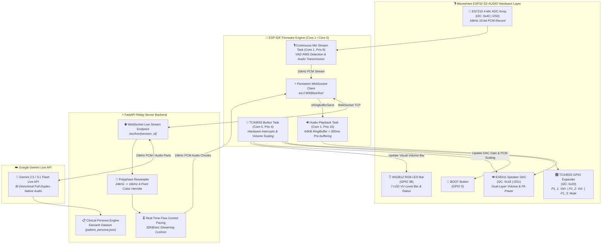

# 🎙️ ESP32-S3 Voice Assistant with Google Gemini Live API & Custom Healthcare Persona


An end-to-end, real-time bi-directional voice assistant built on the **Waveshare ESP32-S3-AUDIO Board** powered by **Google Gemini Live API** and a Custom Clinical Patient Persona.

The system features continuous full-duplex WebSocket audio streaming, 24kHz to 16kHz polyphase cubic Hermite resampler, 4-channel microphone beamforming, ultra-sensitive Voice Activity Detection (VAD), FreeRTOS dual-core task isolation, hardware/software dual-layer volume control, 7-LED RGB visual volume indicator, and interactive physical buttons via the **TCA9555 I2C GPIO Expander**.

---

## 🌟 Key Features

- **⚡ Bi-Directional Full-Duplex Gemini Live Streaming**:
  - Connects ESP32 directly to the Gemini Live API via persistent WebSocket (`/ws/live/{session_id}`).
  - Streams continuous 16kHz 16-bit PCM audio in real time with barge-in interruption capability.
- **🧠 Healthcare Patient Persona Integration (`Samarth`)**:
  - Transcribes spoken voice prompts and provides accurate, empathetic clinical answers strictly derived from [`patient_persona.json`](./backend/patient_persona.json).
  - Tracks weight (70 kg, -16.2 kg weight loss), HbA1c (5.52%), assigned doctor (*Dr. Samarth Gupta*), active medications (*Paracetamol*), blood glucose, daily steps, and vital signs.
- **🎵 Studio-Grade Downsampling & Flow Pacing**:
  - Converts Gemini's 24kHz audio output to 16kHz PCM using a polyphase 4-point cubic Hermite interpolation resampler (`SmoothResampler24kTo16k`).
  - Features real-time flow control pacing to maintain a smooth 500ms lead cushion in the ESP32 ringbuffer.
- **🛡️ High-Performance FreeRTOS Engine & Jitter Absorption**:
  - Audio playback task pinned to dedicated **Core 1** (Priority 10) with 8,192-byte stack and 64KB RingBuffer (`s_audio_play_rb`).
  - Dynamic 300ms pre-buffering cushion (`PLAYBACK_PREBUFFER_BYTES = 9600`) to eliminate Wi-Fi jitter and micro-stutters.
- **🎙️ 4-Channel Multi-Mic Beamforming & Smart VAD**:
  - Samples all 4 channels of the ES7210 microphone ADC array simultaneously, dynamically selecting peak voice amplitude.
- **🎛️ TCA9555 Hardware Buttons & Dual-Layer Volume Control**:
  - Mapped via I2C address `0x20` (Port 1 pins `P1_1`, `P1_2`, `P1_3`) for Volume UP, Volume DOWN, and Mute.
- **💡 7-LED RGB Visual Level Bar**:
  - Illuminates 1 to 7 WS2812 RGB LEDs proportionally to current volume level and system conversational states.

---

## 🏗️ System Architecture



---

## 📄 Technical Diagnostics & Optimization Specs

Detailed technical documentation is available in the repository:
- **[`voice_jitter_technical_details.md`](./voice_jitter_technical_details.md)**: Exhaustive root-cause analysis for network transport, FreeRTOS ringbuffer timeouts (`pdMS_TO_TICKS`), and pacing calculations.
- **[`SYSTEM_OPTIMIZATION_AND_FIXES_SUMMARY.md`](./SYSTEM_OPTIMIZATION_AND_FIXES_SUMMARY.md)**: Executive summary of all memory hardening, stack overflow fixes, and FreeRTOS task isolation.

---

## 🎛️ Hardware Mappings & Pinout

| Component | Driver / Interface | Pin / Address | Description |
| :--- | :--- | :--- | :--- |
| **User Button 1** | TCA9555 I2C Expander | Port 1 Pin 1 (`P1_1`) | **Volume UP (+15%)** |
| **User Button 2** | TCA9555 I2C Expander | Port 1 Pin 2 (`P1_2`) | **Volume DOWN (-15%)** |
| **User Button 3** | TCA9555 I2C Expander | Port 1 Pin 3 (`P1_3`) | **Mute / Unmute Toggle** |
| **BOOT Button** | Native ESP32-S3 GPIO | `GPIO 0` | **Manual Start / Stop Toggle** |
| **Audio DAC (Speaker)** | ES8311 | I2C `0x18`, I2S Port 1 | Audio playback & PA amplifier control |
| **Audio ADC (4-Mics)** | ES7210 | I2C `0x40`, I2S Port 0 | 4-Channel microphone array input |
| **RGB LED Strip** | WS2812 | `GPIO 38` | 7-LED status & visual volume bar |
| **I2C Bus** | ESP-IDF I2C Master | SDA: `GPIO 11`, SCL: `GPIO 10` | Codec & expander communication |

---

## 📁 Repository Structure

```text
ESP32-S3-with-Gemini-and-custom-persona/
├── backend/                        # Python FastAPI Relay Server
│   ├── server.py                   # FastAPI server & Gemini Live API WebSocket endpoint
│   ├── patient_persona.json        # Patient clinical record dataset (Samarth)
│   ├── requirements.txt            # Python dependencies (fastapi, uvicorn, google-genai, edge-tts)
│   ├── test_tts.py                 # Standalone TTS verification script
│   └── .env                        # Gemini API key & model configuration
├── main/                           # ESP32-S3 Firmware (ESP-IDF C Source)
│   ├── main.c                      # App entry point, FreeRTOS tasks, WebSocket client
│   ├── hardeware_driver/           # Codec drivers (bsp_board.c, ES8311, ES7210, TCA9555)
│   ├── rgb_led_driver/             # WS2812 RGB LED strip driver & volume level bar
│   ├── wifi_driver/                # Wi-Fi station mode driver (Power Save: DISABLED)
│   ├── CMakeLists.txt              # Main component CMake manifest
│   └── idf_component.yml           # ESP-IDF component dependencies
├── voice_jitter_technical_details.md   # Diagnostic analysis for audio jitter
├── SYSTEM_OPTIMIZATION_AND_FIXES_SUMMARY.md # System fixes & memory hardening summary
├── CMakeLists.txt                  # Top-level project CMake configuration
├── partitions.csv                  # Custom partition table
├── sdkconfig                       # ESP-IDF configuration manifest
└── README.md                       # Main project documentation
```

---

## 🚀 Quick Start Guide

### 1️⃣ Setting Up the Python Backend Server

1. Navigate to `backend/`:
   ```bash
   cd backend
   ```
2. Install dependencies:
   ```bash
   pip install -r requirements.txt
   ```
3. Set your Google Gemini API Key in `.env`:
   ```env
   GEMINI_API_KEY=your_actual_gemini_api_key_here
   GEMINI_LIVE_MODEL=gemini-2.5-flash-native-audio-latest
   PORT=8008
   ```
4. Start the server:
   ```bash
   python server.py
   ```

---

### 2️⃣ Building and Flashing the ESP32-S3 Firmware

1. Open an ESP-IDF terminal (v5.5).
2. Configure your server IP in `main/main.c`:
   ```c
   #define SERVER_IP   "192.168.50.53"  // Replace with your laptop IP
   #define SERVER_PORT "8008"
   ```
3. Build, flash, and open serial monitor:
   ```bash
   idf.py -p COM6 flash monitor
   ```

---

## 🎙️ Spoken Voice Commands & Interactivity

### Sample Questions You Can Ask:
- **"Hello Assistant"** $\rightarrow$ *"Hello Samarth! I am right here. What would you like to check today?"*
- **"What is my weight?"** $\rightarrow$ *"Hi Samarth! You currently weigh 70 kg, which reflects a weight loss of 16.2 kg."*
- **"Who is my doctor?"** $\rightarrow$ *"Your assigned doctor is Dr. Samarth Gupta."*
- **"What is my HbA1c?"** $\rightarrow$ *"Your latest HbA1c level is 5.52%."*

---

## 📜 License

Distributed under the MIT License. See `LICENSE` for more information.
