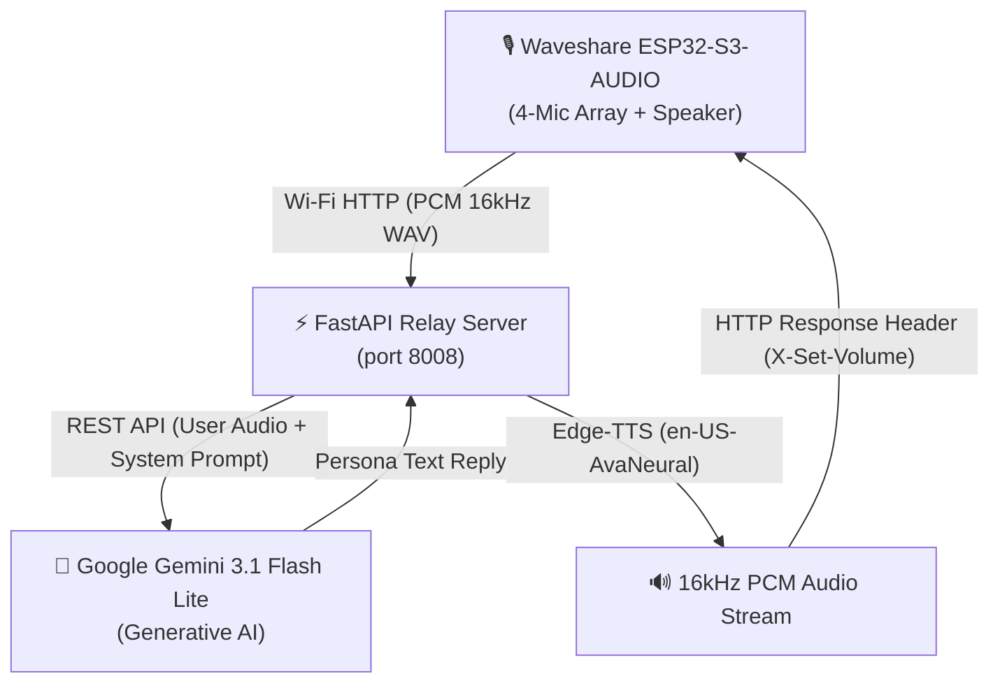

# 🎙️ ESP32-S3 Voice Assistant with Google Gemini 3.1 & Custom Healthcare Persona


An end-to-end, real-time voice assistant built on the **Waveshare ESP32-S3-AUDIO Board** powered by **Google Gemini 3.1 Flash Lite** and a **Custom Clinical Patient Persona (`Samarth`)**.

The system features real-time 4-channel microphone beamforming, ultra-sensitive Voice Activity Detection (VAD), hardware/software dual-layer volume control, 7-LED RGB visual volume level indicator, and interactive physical buttons configured via the **TCA9555 I2C GPIO Expander**.

---

## 🌟 Key Features

- **🧠 Healthcare Patient Persona Integration (`Samarth`)**:
  - Dynamically transcribes spoken voice prompts and provides accurate, empathetic clinical answers strictly derived from [`patient_persona.json`](./backend/patient_persona.json).
  - Tracks weight (70 kg, -16.2 kg weight loss), HbA1c (5.52%), assigned doctor (*Dr. Samarth Gupta*), active medications (*Paracetamol*), blood glucose, daily steps, and vital signs.
- **🎙️ 4-Channel Multi-Mic Beamforming & Smart VAD**:
  - Samples all 4 channels of the ES7210 microphone ADC array simultaneously, dynamically selecting peak voice amplitude for crystal-clear recording.
  - Features intelligent silence gating and DMA queue flushing to eliminate acoustic room echo and prevent self-repeating response loops.
- **🎛️ TCA9555 Expander Hardware Buttons**:
  - Physical button controls mapped via I2C address `0x20` (Port 1 pins `P1_1`, `P1_2`, `P1_3`).
- **💡 7-LED RGB Visual Level Bar**:
  - Illuminates 1 to 7 WS2812 RGB LEDs proportionally to current volume when adjusting level.
  - Indicates system status: Blue (Wi-Fi connecting), Cyan (Recording), Solid Red (Muted), Solid Green (Unmuted).
- **🔊 Dual-Layer Volume Control**:
  - Synchronously updates the hardware ES8311 DAC codec register and applies mathematical PCM sample amplitude scaling (`sample * vol / 100`) in real time.
- **🗣️ Natural Edge-TTS Voice Playback**:
  - Uses `en-US-AvaNeural` voice with customizable rate/volume for smooth, natural smart speaker playback.

---

## 🏗️ System Architecture



---

## 🎛️ Hardware Mappings & Pinout

### Waveshare ESP32-S3-AUDIO Board Layout
| Component | Driver / Interface | Pin / Address | Description |
| :--- | :--- | :--- | :--- |
| **User Button 1** | TCA9555 I2C Expander | Port 1 Pin 1 (`P1_1`) | **Volume UP (+15%)** |
| **User Button 2** | TCA9555 I2C Expander | Port 1 Pin 2 (`P1_2`) | **Volume DOWN (-15%)** |
| **User Button 3** | TCA9555 I2C Expander | Port 1 Pin 3 (`P1_3`) | **Mute / Unmute Toggle** |
| **BOOT Button** | Native ESP32-S3 GPIO | `GPIO 0` | **Mute / Unmute Toggle** |
| **RESET Button** | Hardware Chip Reset | `EN` Pin | **ESP32-S3 Hardware Reset** |
| **Audio DAC (Speaker)** | ES8311 | I2C `0x18`, I2S Port 1 | Audio playback & PA amplifier control |
| **Audio ADC (4-Mics)** | ES7210 | I2C `0x40`, I2S Port 0 | 4-Channel microphone array input |
| **RGB LED Strip** | WS2812 | `GPIO 38` | 7-LED status & visual volume bar |
| **I2C Bus** | ESP-IDF I2C Master | SDA: `GPIO 11`, SCL: `GPIO 10` | Codec & expander communication |

---

## 📁 Repository Structure

```text
ESP32-S3-with-Gemini-and-custom-persona/
├── backend/                        # Python FastAPI Relay Server
│   ├── server.py                   # Main FastAPI server & Gemini 3.1 API handler
│   ├── patient_persona.json        # Patient clinical record dataset (Samarth)
│   ├── requirements.txt            # Python dependencies (fastapi, uvicorn, google-genai, edge-tts)
│   ├── test_tts.py                 # Standalone Edge-TTS verification script
│   └── .env.example                # Template for Gemini API key & model settings
├── main/                           # ESP32-S3 Firmware (ESP-IDF C Source)
│   ├── main.c                      # Application entry point, VAD recorder, HTTP client
│   ├── hardeware_driver/           # Hardware drivers (bsp_board.c, ES8311, ES7210, TCA9555)
│   ├── rgb_led_driver/             # WS2812 RGB LED strip driver & volume level bar
│   ├── wifi_driver/                # Wi-Fi station mode driver
│   ├── CMakeLists.txt              # Main component CMake manifest
│   └── idf_component.yml           # ESP-IDF component dependencies
├── CMakeLists.txt                  # Top-level project CMake configuration
├── partitions.csv                  # Custom 2MB app partition table
├── sdkconfig                       # ESP-IDF configuration manifest
└── README.md                       # Complete project documentation
```

---

## 🚀 Quick Start Guide

### 1️⃣ Setting Up the Python Backend Server

1. Navigate to the `backend/` directory:
   ```bash
   cd backend
   ```
2. Create and activate a virtual environment (optional but recommended):
   ```bash
   python -m venv venv
   source venv/bin/activate  # Linux/macOS
   # venv\Scripts\activate   # Windows
   ```
3. Install required Python packages:
   ```bash
   pip install -r requirements.txt
   ```
4. Configure your environment variables:
   - Copy `.env.example` to `.env`:
     ```bash
     cp .env.example .env
     ```
   - Edit `.env` and set your Google Gemini API key:
     ```env
     GEMINI_API_KEY=your_actual_gemini_api_key_here
     GEMINI_MODEL=gemini-3.1-flash-lite
     PORT=8008
     ```
5. Start the relay server:
   ```bash
   python server.py
   ```
   The server will start on `http://0.0.0.0:8008`.

---

### 2️⃣ Building and Flashing the ESP32-S3 Firmware

1. Open an ESP-IDF terminal (v5.5 recommended).
2. Set your server IP in `main/main.c`:
   ```c
   #define SERVER_IP   "192.168.50.53"  // Replace with your laptop/server IP address
   #define SERVER_PORT "8008"
   ```
3. Build, flash, and open the serial monitor:
   ```bash
   idf.py -p COM6 build flash monitor
   ```

---

## 🎙️ Spoken Voice Commands & Interactivity

### Sample Questions You Can Ask:
- **"What is my weight?"** $\rightarrow$ *"Hi Samarth! You currently weigh 70 kg, which reflects a weight loss of 16.2 kg."*
- **"Who is my doctor?"** $\rightarrow$ *"Your assigned doctor is Dr. Samarth Gupta, an Endocrinologist."*
- **"What is my HbA1c?"** $\rightarrow$ *"Your latest HbA1c level is 5.52%."*
- **"What are my daily steps?"** $\rightarrow$ *"Your recorded activity shows 3,694 daily steps."*

### Voice Volume Commands:
- *"Volume up"* / *"Make it louder"* $\rightarrow$ Increases volume to 85%.
- *"Lower volume"* / *"Make it softer"* $\rightarrow$ Decreases volume to 35%.
- *"Mute"* $\rightarrow$ Mutes speaker output.

---

## 📜 License

Distributed under the MIT License. See `LICENSE` for more information.
